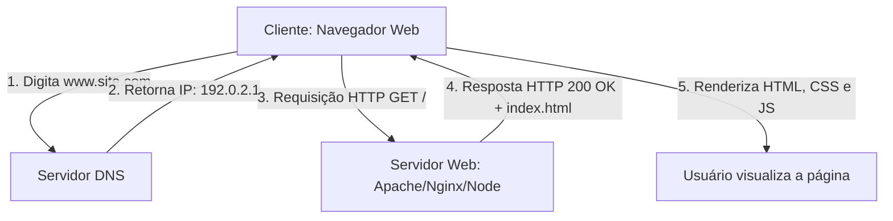

# Aula 01: Fundamentos da Web, Arquitetura Cliente-Servidor e Setup

## 🎯 Objetivos da Aula
- Compreender a diferença crucial entre **Internet** (infraestrutura) e **Web** (serviço).
- Entender a arquitetura **Cliente-Servidor** e como funcionam requisições HTTP e resolução DNS.
- Configurar o ambiente de desenvolvimento profissional com **VS Code**, extensões **Live Server** e **Prettier**.
- Compreender a anatomia do documento HTML5 e a sintaxe de tags e atributos.
- Escrever o primeiro arquivo `index.html` e utilizar atalhos de produtividade com **Emmet**.

---

## 🧭 Roteiro da Aula
1. **Teoria**: Como a Internet funciona na prática, o que é um servidor web e o ciclo de Request/Response.
2. **Ambiente**: Instalação e configuração de atalhos e extensões no VS Code.
3. **Mão na Massa**: Construção da primeira página web estruturada com tags de cabeçalho (`<h1>` a `<h6>`), parágrafos (`<p>`) e separadores.
4. **Laboratório**: Siga as instruções do [laboratorio.md](laboratorio.md).

---

## 📖 1. Da Infraestrutura à Web: Como tudo funciona?

Muitos confundem "Internet" com "Web", mas são coisas distintas:

* **A Internet (A Estrada):** É a rede física mundial de computadores interconectados por cabos submarinos de fibra óptica, satélites e roteadores. Ela existe desde o final da década de 1960 (nascida como ARPANET).
* **A World Wide Web (Os Veículos na Estrada):** Criada em 1989 pelo cientista britânico **Tim Berners-Lee** no CERN, a Web é um *sistema de documentos em hipertexto* interligados que trafegam através da Internet.



---

## 📖 2. Anatomia de uma URL e Requisições HTTP

Quando você digita `https://cursos.iteam.edu.br/web/index.html`:
* **Protocolo (`https://`):** O idioma seguro utilizado na comunicação.
* **Domínio / Host (`cursos.iteam.edu.br`):** O nome amigável registrado que aponta para um endereço IP numérico.
* **Caminho / Recurso (`/web/index.html`):** O arquivo exato que você está pedindo ao servidor.

### O Ciclo Request-Response:
* **Request (Requisição):** Enviada pelo cliente. Informa o método (`GET` para buscar, `POST` para enviar), headers e parâmetros.
* **Response (Resposta):** Devolvida pelo servidor. Traz um código de status (ex: `200 OK`, `404 Not Found`) e o conteúdo do arquivo.

---

## 📖 3. Anatomia do Documento HTML5

HTML (**H**yper**T**ext **M**arkup **L**anguage) não é uma linguagem de programação; é uma **linguagem de marcação**. Nós utilizamos **tags** para dar significado e estrutura ao texto.

```html
<!DOCTYPE html>
<html lang="pt-BR">
<head>
    <meta charset="UTF-8">
    <meta name="viewport" content="width=device-width, initial-scale=1.0">
    <title>Meu Primeiro Site</title>
</head>
<body>
    <h1>Olá, Mundo!</h1>
    <p>Bem-vindo ao desenvolvimento web moderno.</p>
</body>
</html>
```

### Explicando Linha por Linha:
1. `<!DOCTYPE html>`: Avisa ao navegador moderno que o documento utiliza a versão atual do padrão HTML5 (modo padrão de renderização).
2. `<html lang="pt-BR">`: Elemento raiz de toda a página. O atributo `lang="pt-BR"` é vital para acessibilidade (leitores de tela) e motores de busca (SEO).
3. `<head>`: Contém os **metadados** (informações *sobre* o site que não aparecem visíveis na área de visualização).
   * `<meta charset="UTF-8">`: Permite acentuação correta da língua portuguesa (ex: ç, ã, é).
   * `<meta name="viewport" content="width=device-width, initial-scale=1.0">`: Configuração essencial para que o site adapte a escala da tela em celulares e tablets.
   * `<title>`: O nome da aba do navegador e o título principal nas buscas do Google.
4. `<body>`: Contém **tudo o que o usuário efetivamente enxerga** na página (textos, imagens, botões).

---

## 📖 4. Tags de Texto e Hierarquia Visual

```html
<!-- Cabeçalhos: Devem respeitar hierarquia de importância -->
<h1>Título Principal da Página (Apenas 1 por página para bom SEO)</h1>
<h2>Subtítulo ou Seção de Assunto</h2>
<h3>Tópico Secundário</h3>
<h4>Subtópico</h4>
<h5>Detalhe técnico</h5>
<h6>Menor nível de cabeçalho</h6>

<!-- Parágrafo -->
<p>Este é um parágrafo de texto corrido. O navegador adiciona margem automática.</p>

<!-- Quebra de linha forçada (usar com moderação) -->
<br>

<!-- Linha horizontal separadora temática -->
<hr>

<!-- Destaques -->
<p>Texto com <strong>destaque semântico importante</strong> e texto em <em>ênfase inclinada</em>.</p>
```

---

## 🚀 Dica de Produtividade: Emmet no VS Code
No VS Code, você nunca digita tags do zero:
* Digite `!` e pressione `Tab` ou `Enter`: o esqueleto HTML5 completo é gerado na hora!
* Digite `h1` e pressione `Tab`: gera `<h1></h1>`.
* Digite `p*3>lorem10` e pressione `Tab`: gera 3 parágrafos com 10 palavras em latim para teste!

Agora execute o laboratório em [laboratorio.md](laboratorio.md)!
