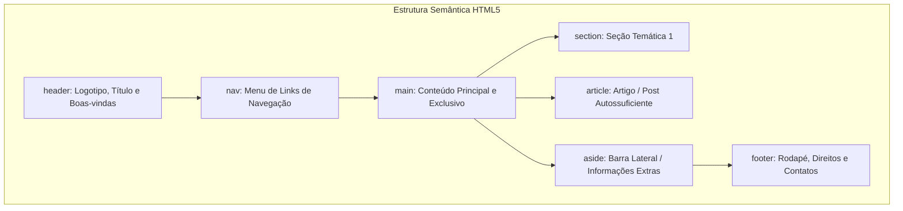

# Aula 02: Estrutura Semântica do HTML5, Listas, Tabelas e Recursos Multimídia

## 🎯 Objetivos da Aula
- Superar o modelo legado da "divite" e adotar as tags semânticas do HTML5 (`header`, `nav`, `main`, `section`, `article`, `aside`, `footer`).
- Criar listas ordenadas, não-ordenadas e estruturar menus de navegação.
- Construir tabelas de dados completas com cabeçalho (`<thead>`), corpo (`<tbody>`) e rodapé (`<tfoot>`).
- Dominar links e âncoras internas e externas com segurança (`rel="noopener noreferrer"`).
- Inserir e otimizar recursos multimídia nativos: imagens com `alt` obrigatório, áudios e vídeos com controles interativos.

---

## 🧭 Roteiro da Aula
1. **Semântica:** Por que tags semânticas são vitais para o SEO do Google e leitores de tela para pessoas com deficiência visual.
2. **Listas e Links:** Criação de menus navegáveis e links internos com âncoras.
3. **Tabelas:** Estruturação tabular de dados respeitando padrões modernos.
4. **Multimídia Nativa:** Áudios, vídeos e imagens responsivas.
5. **Laboratório:** Siga o passo a passo em [laboratorio.md](laboratorio.md).

---

## 📖 1. O Fim da "Divite" e a Semântica do HTML5

Nos anos 2000, os desenvolvedores criavam páginas inteiras usando apenas `<div>` para tudo:
```html
<!-- ❌ MODO ANTIGO (Sem semântica - "Divite") -->
<div id="cabecalho">...</div>
<div id="menu">...</div>
<div id="conteudo-principal">
    <div class="post">...</div>
</div>
<div id="rodape">...</div>
```

Para o navegador ou um leitor de tela para cegos, uma `<div>` é apenas uma caixa invisível vazia de significado. 

O **HTML5** revolucionou isso introduzindo tags que expressam **exatamente o papel daquele conteúdo**:



### O Papel de Cada Tag:
| Tag | Significado | Regra de Uso |
| :--- | :--- | :--- |
| `<header>` | Cabeçalho do site ou de uma seção. | Contém logotipo, título e chamada de ação. |
| `<nav>` | Navegação principal. | Envolve menus de links (`<ul><li><a>`). |
| `<main>` | Conteúdo principal da página. | **Deve existir apenas UM por página!** |
| `<section>` | Seção temática genérica. | Deve ter um cabeçalho (`<h2>` a `<h6>`). |
| `<article>` | Conteúdo independente. | Faz sentido se for lido isoladamente (ex: notícia, post de blog, card de produto). |
| `<aside>` | Conteúdo periférico / secundário. | Barras laterais, glossários, banners ou links relacionados. |
| `<footer>` | Rodapé. | Informações de copyright, autor, termos de uso e links institucionais. |

---

## 📖 2. Listas e Navegação

Existem dois tipos fundamentais de listas:
1. **Listas Não Ordenadas (`<ul>`):** Onde a ordem dos itens não altera o significado (marcadores de bolinhas).
2. **Listas Ordenadas (`<ol>`):** Onde a sequência numérica importa (passo a passo, receitas, rankings).

```html
<!-- Menu de Navegação Típico -->
<nav>
    <ul>
        <li><a href="#inicio">Início</a></li>
        <li><a href="#cursos">Cursos</a></li>
        <li><a href="#contato">Fale Conosco</a></li>
    </ul>
</nav>

<!-- Lista Ordenada de Instruções -->
<h3>Passo a Passo para Instalação</h3>
<ol>
    <li>Baixe o instalador oficial.</li>
    <li>Execute o assistente como administrador.</li>
    <li>Reinicie o computador.</li>
</ol>
```

---

## 📖 3. Links e Âncoras (`<a>`)

A tag `<a>` (**Anchor**) é a cola que une toda a internet.

### Link Externo com Boa Prática de Segurança:
```html
<!-- target="_blank" abre em nova aba.
     rel="noopener noreferrer" impede que a página aberta acerte o window.opener (evita brecha de segurança) -->
<a href="https://iteam.edu.br" target="_blank" rel="noopener noreferrer">
    Visitar Portal Oficial do ITEAM
</a>
```

### Link Interno (Âncora na mesma página):
```html
<!-- 1. Cria o link que aponta para o ID com '#' -->
<a href="#sobre-o-curso">Pular para Detalhes</a>

<!-- 2. Cria o elemento de destino com o atributo 'id' correspondente -->
<section id="sobre-o-curso">
    <h2>Detalhes do Curso</h2>
    <p>O curso possui 32 horas de imersão...</p>
</section>
```

---

## 📖 4. Tabelas de Dados Completas

Tabelas no HTML **não servem para diagramar layout**. Elas servem estritamente para exibir **dados tabulares bidimensionais**:

```html
<table border="1">
    <caption>Tabela de Desempenho dos Alunos</caption>
    <thead>
        <tr>
            <th>Aluno</th>
            <th>Módulo</th>
            <th>Nota A1</th>
            <th>Nota A2</th>
        </tr>
    </thead>
    <tbody>
        <tr>
            <td>Maria Silva</td>
            <td>Front-end</td>
            <td>9.5</td>
            <td>10.0</td>
        </tr>
        <tr>
            <td>Pedro Santos</td>
            <td>Front-end</td>
            <td>8.0</td>
            <td>8.5</td>
        </tr>
    </tbody>
    <tfoot>
        <tr>
            <td colspan="2"><strong>Média da Turma</strong></td>
            <td colspan="2"><strong>9.0</strong></td>
        </tr>
    </tfoot>
</table>
```
* `<caption>`: Título acessível da tabela.
* `<thead>`, `<tbody>`, `<tfoot>`: Separação semântica de topo, dados e fechamento.
* `<th>`: Célula de cabeçalho (renderiza em negrito e centralizada).
* `<td>`: Célula de dado comum.
* `colspan="2"`: Faz uma célula ocupar duas colunas adjacentes.

---

## 📖 5. Recursos Multimídia Nativa: Imagens, Áudio e Vídeo

O HTML5 eliminou a necessidade de plugins pesados (como o antigo Adobe Flash), tornando o consumo de mídia nativo e leve.

### Imagens com Acessibilidade:
```html
<!-- O atributo 'alt' é OBRIGATÓRIO! Ele é lido por cegos e exibido se a imagem falhar -->

```
> **Dica de Ouro:** O atributo `loading="lazy"` adia o carregamento de imagens fora da tela até que o usuário role até elas, economizando até 70% de dados da internet móvel!

### Áudio Nativo:
```html
<audio controls>
    <source src="podcast-aula02.mp3" type="audio/mpeg">
    <source src="podcast-aula02.ogg" type="audio/ogg">
    Seu navegador não suporta a tag de áudio HTML5.
</audio>
```

### Vídeo Nativo com Capa:
```html
<video controls width="640" poster="capa-do-video.jpg">
    <source src="aula-gravada.mp4" type="video/mp4">
    <source src="aula-gravada.webm" type="video/webm">
    Seu navegador não suporta a tag de vídeo HTML5.
</video>
```

Execute o laboratório prático em [laboratorio.md](laboratorio.md)!
