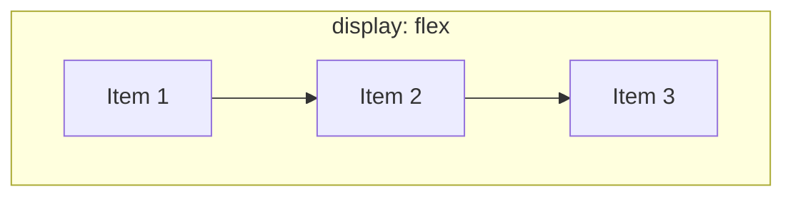

# Aula 05: Layouts Modernos (Flexbox, CSS Grid) e Design Responsivo

## 🎯 Objetivos da Aula
- Dominar o **CSS Flexbox** para alinhamentos unidimensionais fluidos em linhas ou colunas.
- Dominar o **CSS Grid Layout** para matrizes bidimensionais complexas (galerias, portais e dashboards).
- Compreender o conceito de **Mobile-First** e a importância da meta tag `viewport`.
- Escrever **Media Queries (`@media`)** para adaptar o layout a celulares, tablets e telas widescreen.
- Desenvolver e entregar a **Avaliação Prática A2**.

---

## 🧭 Roteiro da Aula
1. **Flexbox na Prática:** O eixo principal (*main axis*) e o eixo transversal (*cross axis*).
2. **CSS Grid na Prática:** Como fatiar uma tela em colunas proporcionais com a unidade fracionária `fr`.
3. **Design Responsivo:** A regra das Media Queries e quebras de layout (*breakpoints*).
4. **Laboratório e Avaliação A2:** Siga o passo a passo em [laboratorio.md](laboratorio.md) e o regulamento em [Avaliações A2](../Avaliacoes/A2/README.md).

---

## 📖 1. CSS Flexbox: O Mestre dos Alinhamentos

O Flexbox organiza elementos em **uma única dimensão** por vez (ou em linha, ou em coluna).



### Propriedades do Pai (`display: flex`):
```css
.container {
    display: flex;
    
    /* Direção do fluxo: row (linha padrão) ou column (coluna vertical) */
    flex-direction: row;
    
    /* Alinhamento no eixo principal (horizontal quando row): */
    /* flex-start | center | flex-end | space-between | space-around | space-evenly */
    justify-content: space-between;
    
    /* Alinhamento no eixo transversal (vertical quando row): */
    /* stretch | center | flex-start | flex-end */
    align-items: center;
    
    /* Permite que itens quebrem para a linha de baixo se não couberem */
    flex-wrap: wrap;
    
    /* Espaçamento automático entre os itens sem precisar de margin! */
    gap: 20px;
}
```

### Propriedades dos Filhos:
```css
.item {
    /* Faz o item crescer para ocupar o espaço disponível igualmente */
    flex: 1;
}
```

---

## 📖 2. CSS Grid: O Mestre dos Layouts Bidimensionais

Enquanto o Flexbox cuida de linhas isoladas, o **CSS Grid** cuida de **linhas E colunas simultaneamente**.

```css
.galeria {
    display: grid;
    
    /* 3 colunas de tamanho exatamente igual usando a unidade 'fr' (fração) */
    grid-template-columns: 1fr 1fr 1fr;
    
    /* Ou de forma automática e responsiva sem media queries: */
    /* grid-template-columns: repeat(auto-fit, minmax(250px, 1fr)); */
    
    gap: 24px;
}
```

---

## 📖 3. Design Responsivo e Media Queries

Mais de **60% do tráfego web mundial vem de celulares**. Se o seu site quebra no smartphone, seu projeto falhou.

### 1. A Meta Tag Inegociável (no `<head>`):
```html
<meta name="viewport" content="width=device-width, initial-scale=1.0">
```
* Sem essa linha, o celular tenta simular uma tela de computador gigante e o texto fica minúsculo e ilegível.

### 2. A Sintaxe das Media Queries:
O CSS aplica regras condicionais de acordo com a largura da tela do dispositivo:

```css
/* Estilo Padrão (Desktop / Telas Grandes) */
.grade-produtos {
    display: grid;
    grid-template-columns: repeat(4, 1fr); /* 4 colunas */
    gap: 20px;
}

/* 📱 Quando a tela for menor ou igual a 768px (Tablets e Celulares na Horizontal) */
@media (max-width: 768px) {
    .grade-produtos {
        grid-template-columns: repeat(2, 1fr); /* Reduz para 2 colunas */
    }
}

/* 📱 Quando a tela for menor ou igual a 480px (Smartphones na Vertical) */
@media (max-width: 480px) {
    .grade-produtos {
        grid-template-columns: 1fr; /* 1 única coluna ocupando a largura total */
    }
    
    .cabecalho-menu {
        flex-direction: column; /* Menu de links fica empilhado verticalmente */
    }
}
```

Execute o laboratório prático em [laboratorio.md](laboratorio.md) e prepare a **Entrega A2**!
