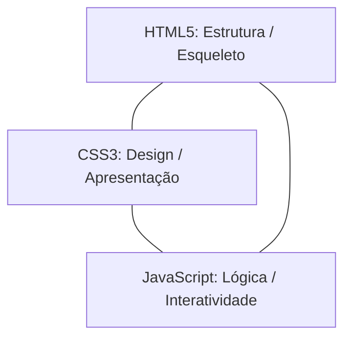

# Aula 06: Introdução ao JavaScript — Lógica, Tipos e Controle de Fluxo

## 🎯 Objetivos da Aula
- Compreender o papel do JavaScript como o cérebro comportamental e dinâmico da página web.
- Vincular scripts externos via tag `<script src="...">` e depurar com `console.log()`.
- Dominar a declaração de variáveis modernas: `const` e `let`, e entender por que a palavra-chave legada `var` foi abandonada.
- Trabalhar com tipos de dados primitivos: `string`, `number`, `boolean`, `null` e `undefined`.
- Aplicar operadores aritméticos, relacionais estritos (`===`, `!==`) e lógicos (`&&`, `||`, `!`).
- Estruturar tomadas de decisão com `if`, `else if`, `else`, `switch/case` e laços de repetição `for` e `while`.

---

## 🧭 Roteiro da Aula
1. **O Motor dos Navegadores:** O que é a engine V8 e como ela executa JavaScript.
2. **Setup do Script:** Inclusão correta no final do `<body>` ou com `defer`.
3. **Variáveis e Tipos:** A importância da imutabilidade com `const`.
4. **Comparações Seguras:** Por que sempre usamos `===` em vez de `==`.
5. **Laboratório Prático:** Siga o passo a passo em [laboratorio.md](laboratorio.md).

---

## 📖 1. O Triângulo do Front-end



* **HTML:** "Existe um botão na tela com o texto 'Curtir'".
* **CSS:** "O botão é azul, tem cantos arredondados e brilha ao passar o mouse".
* **JavaScript:** "Quando o usuário clicar no botão, incremente o contador, mude a cor para vermelho e salve a curtida no servidor".

---

## 📖 2. Como Incluir o JavaScript no HTML

```html
<!DOCTYPE html>
<html lang="pt-BR">
<head>
    <meta charset="UTF-8">
    <title>Meu Projeto JS</title>
</head>
<body>
    <h1>Lógica com JavaScript</h1>

    <!-- Boa Prática: Incluir o script no final do <body> para não bloquear a renderização da tela -->
    <script src="script.js"></script>
</body>
</html>
```

---

## 📖 3. Variáveis Modernas: `const` e `let` vs. `var`

No JavaScript moderno (ES6+), **nunca usamos `var`**:
* **`var` (Legado / Proibido):** Possui vazamento de escopo (*hoisting*) e permite redeclarações acidentais que causam bugs gravíssimos.
* **`const` (Regra Padrão):** Cria variáveis que **não podem ser reatribuídas**. Use sempre por padrão para evitar alterações acidentais de valor.
* **`let` (Apenas quando necessário):** Use somente quando você souber com certeza que o valor da variável precisará mudar ao longo do tempo (ex: contadores de loop).

```javascript
// ✅ const: O valor permanece fixo
const nomeEscola = "ITEAM";
const pi = 3.14159;
// nomeEscola = "Outra"; // ❌ ERRO: Assignment to constant variable!

// ✅ let: O valor pode mudar
let tentativas = 0;
tentativas = tentativas + 1; // Funciona perfeitamente
```

---

## 📖 4. Tipos de Dados Primitivos

```javascript
const texto = "Olá, mundo!"; // String (texto entre aspas simples, duplas ou crases)
const idade = 25;              // Number (números inteiros ou decimais com ponto)
const preco = 99.90;           // Number
const matriculado = true;       // Boolean (true ou false)
let endereco = null;           // Null (ausência intencional de valor)
let telefone;                  // Undefined (variável declarada mas ainda sem valor)
```

---

## 📖 5. Operadores e a Regra do `===`

No JavaScript, o operador `==` tenta converter tipos automaticamente, gerando resultados bizarros (ex: `'0' == false` retorna `true`). 

**Regra de Ouro:** Use SEMPRE o operador de igualdade estrita `===` (compara valor E tipo):

```javascript
const valorA = 10;    // Number
const valorB = "10";  // String

console.log(valorA == valorB);  // true (Conversão perigosa!)
console.log(valorA === valorB); // false (Correto: um é número, o outro é texto!)
```

### Operadores Lógicos:
* **`&&` (E / AND):** Retorna `true` apenas se **todas** as condições forem verdadeiras.
* **`||` (OU / OR):** Retorna `true` se **pelo menos uma** condição for verdadeira.
* **`!` (NÃO / NOT):** Inverte o valor booleano (`!true` vira `false`).

---

## 📖 6. Estruturas de Decisão e Repetição

```javascript
// Condicional com if / else if / else
const mediaFinal = 8.5;

if (mediaFinal >= 7.0) {
    console.log("Parabéns! Aluno Aprovado.");
} else if (mediaFinal >= 5.0) {
    console.log("Aluno em Recuperação.");
} else {
    console.log("Aluno Reprovado.");
}

// Laço de Repetição: for
for (let i = 1; i <= 5; i++) {
    console.log(`Executando passo número: ${i}`);
}

// Percorrendo um Array com for...of
const cursos = ["HTML5", "CSS3", "JavaScript", "Node.js"];
for (const curso of cursos) {
    console.log(`Módulo do ITEAM: ${curso}`);
}
```

Pratique os desafios de lógica no [laboratorio.md](laboratorio.md)!
