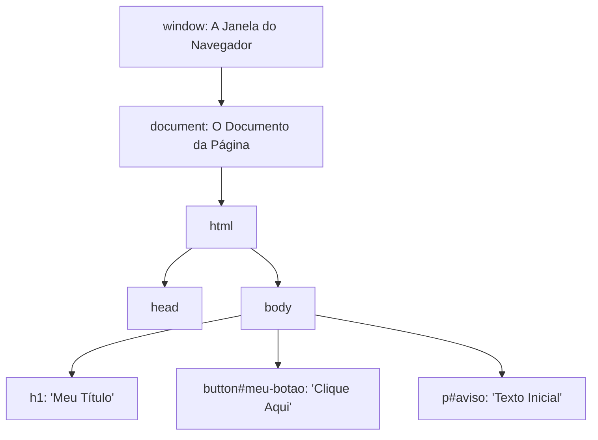

# Aula 07: Manipulação do DOM e Eventos do Usuário

## 🎯 Objetivos da Aula
- Compreender o que é a árvore do **DOM (Document Object Model)** e como o navegador mapeia o HTML em nós de memória.
- Selecionar elementos HTML com os métodos modernos `document.querySelector()` e `document.querySelectorAll()`.
- Alterar dinamicamente textos e classes em tempo de execução usando `.textContent` e `.classList` (`add`, `remove`, `toggle`).
- Entender o modelo de **Ação & Reação**: conectar um evento de clique (`click`) à modificação de outro elemento da página.
- Interceptar o recarregamento indesejado da página com `event.preventDefault()`.
- Construir componentes dinâmicos do mundo real (menu mobile hambúrguer, contador interativo e lista de tarefas).

---

## 🧭 Roteiro da Aula
1. **O que é o DOM?** Como o JS acessa a página depois que o HTML foi renderizado.
2. **Seletores Modernos:** O poder da sintaxe CSS dentro do JavaScript com `querySelector`.
3. **O Modelo Mental de Ação e Reação:** Como conectar eventos a alterações na tela.
4. **Manipulação de Classes com `classList`:** `.add()`, `.remove()` e `.toggle()`.
5. **Como Testar em Tempo Real no DevTools (F12).**
6. **Laboratório Prático:** Siga o passo a passo em [laboratorio.md](laboratorio.md).
7. **Slides da Aula:** Acompanhe a apresentação em [slides.md](slides.md).

---

## 📖 1. O que é o DOM?

O DOM é a representação viva da sua página HTML em formato de árvore de objetos na memória do navegador:



O objeto global `document` é a nossa porta de entrada mágica para buscar, criar, modificar ou excluir qualquer tag da página em tempo de execução!

---

## 📖 2. Selecionando Elementos com `querySelector`

O método moderno `querySelector` utiliza a **mesma sintaxe que você já aprendeu no CSS**:

```javascript
// Seleciona o primeiro elemento que coincidir com o seletor CSS:
const titulo = document.querySelector("h1");             // Por tag
const botao = document.querySelector(".btn-salvar");      // Por classe
const inputEmail = document.querySelector("#campo-email"); // Por ID

// Seleciona TODOS os elementos coincidentes (retorna uma lista NodeList):
const todosCards = document.querySelectorAll(".card");
```

---

## 📖 3. Como Funciona a Interatividade: O Modelo "Ação & Reação"

> ❓ **Dúvida comum dos alunos:**  
> *"Se eu escrever `paragrafo.classList.add('ativo')`, quando isso acontece?"*

Se você escrever essa linha solta no seu script, ela roda **apenas uma vez**, na fração de segundo em que a página carrega.  
Para que a alteração aconteça **em resposta ao usuário**, precisamos de 3 atores trabalhando juntos:

```
┌─────────────────────────┐      ┌─────────────────────────┐      ┌─────────────────────────┐
│       1. GATILHO        │      │       2. OUVINTE        │      │       3. REAÇÃO         │
│  Elemento que sofre a   │ ───> │   Escuta a ação com     │ ───> │  Código que altera o    │
│    ação (ex: Botão)     │      │   addEventListener()    │      │  elemento alvo no DOM   │
└─────────────────────────┘      └─────────────────────────┘      └─────────────────────────┘
```

### Exemplo Completo Integrado (HTML + CSS + JS)

#### 1. No HTML:
```html
<!-- O Gatilho (quem o usuário clica) -->
<button id="btn-alerta">Alternar Aviso</button>

<!-- O Alvo (quem vai mudar) -->
<p id="aviso">Atenção: Sistema funcionando normalmente.</p>
```

#### 2. No CSS:
```css
/* Estado padrão */
#aviso {
    padding: 12px;
    border-radius: 6px;
    background-color: #f1f5f9;
    color: #475569;
    transition: all 0.3s ease;
}

/* Estado ativo (ativado dinamicamente pelo JavaScript) */
#aviso.destaque {
    background-color: #fef08a; /* Amarelo de alerta */
    color: #854d0e;
    font-weight: bold;
    border-left: 4px solid #ca8a04;
}
```

#### 3. No JavaScript:
```javascript
// Passo 1: Selecionar o Gatilho e o Alvo
const botao = document.querySelector("#btn-alerta");
const paragrafo = document.querySelector("#aviso");

// Passo 2: Adicionar o Ouvinte de Evento (addEventListener)
botao.addEventListener("click", () => {
    // Passo 3: A Reação executada em tempo de execução ao clicar!
    
    // O .toggle() verifica: se a classe 'destaque' já existe, remove. Se não existe, adiciona!
    paragrafo.classList.toggle("destaque");

    // Também podemos alterar o texto conforme a classe:
    if (paragrafo.classList.contains("destaque")) {
        paragrafo.textContent = "⚠️ Alerta ATIVADO pelo usuário!";
    } else {
        paragrafo.textContent = "Atenção: Sistema funcionando normalmente.";
    }
});
```

---

## 📖 4. Os Métodos do `classList` em Detalhes

O `classList` é uma lista especial de todas as classes CSS aplicadas àquele elemento. Ele possui 4 métodos essenciais:

| Método | O que faz? | Quando usar? |
|---|---|---|
| **`.add('classe')`** | Adiciona a classe (se já não tiver) | Ao confirmar uma ação ou sucesso (ex: marcar como concluído). |
| **`.remove('classe')`** | Remove a classe (se ela existir) | Ao cancelar ou resetar um estado (ex: fechar modal). |
| **`.toggle('classe')`** | Alterna: se tem tira, se não tem põe | Perfeito para botões de abrir/fechar (menu mobile, temas claro/escuro). |
| **`.contains('classe')`** | Retorna `true` ou `false` | Para testar se o elemento está ativo ou inativo dentro de um `if`. |

```javascript
const notificacao = document.querySelector("#box-notificacao");

// Adicionando uma classe de erro:
notificacao.classList.add("erro");

// Removendo a classe de oculto para exibi-la:
notificacao.classList.remove("oculto");

// Verificando antes de tomar decisão:
if (notificacao.classList.contains("erro")) {
    console.log("O usuário está visualizando uma mensagem de erro.");
}
```

---

## 📖 5. Como Testar e Demonstrar em Tempo Real no DevTools (F12)

Você pode mostrar para a turma o JavaScript alterando o DOM em tempo real **sem mexer em nenhum arquivo**:

1. Abra qualquer página web no navegador (Google Chrome ou Microsoft Edge).
2. Pressione **`F12`** e clique na aba **Console**.
3. Na linha de comando do console (onde tem o cursor `>`), digite:
   ```javascript
   // 1. Busca o primeiro parágrafo da página:
   const p = document.querySelector("p");

   // 2. Altera o texto dele imediatamente:
   p.textContent = "Texto alterado ao vivo via Console do DevTools!";

   // 3. Aplica uma cor diretamente:
   p.style.color = "red";
   p.style.fontSize = "24px";
   ```
4. Pressione **`Enter`**: a página muda instantaneamente na frente dos alunos!
5. Pressione **`F5`** (Recarregar): a página volta ao estado original, provando que **o DOM vive na memória RAM e não altera o arquivo do disco**.

---

## 📖 6. O Poder do `event.preventDefault()` em Formulários

Por padrão histórico dos navegadores dos anos 90, quando um formulário é enviado, a tela inteira pisca e recarrega. Em aplicações modernas, nós bloqueamos esse recarregamento:

```javascript
const form = document.querySelector("#meu-formulario");
const inputTarefa = document.querySelector("#campo-tarefa");

form.addEventListener("submit", (evento) => {
    // 🛑 REGRA CRÍTICA: Bloqueia o reload automático!
    evento.preventDefault();

    const valor = inputTarefa.value.trim();
    if (valor !== "") {
        console.log("Tarefa capturada com sucesso:", valor);
        inputTarefa.value = ""; // Limpa o campo
    }
});
```

---

## 🚀 Próximos Passos
- Para a prática completa guiada, acesse o **[laboratorio.md](laboratorio.md)**.
- Para a apresentação em sala de aula, consulte os **[slides.md](slides.md)**.
- Para ver o código final completo funcionando, consulte o **[Gabarito da Aula 07](../gabaritos/Aula07/README.md)**.
- Para entender o impacto da manipulação do DOM em SEO, acessibilidade e por que o getElementById ficou no passado, consulte o **[Guia de Arquitetura DOM & SEO](../docs/dom-seo-e-boas-praticas.md)**.
