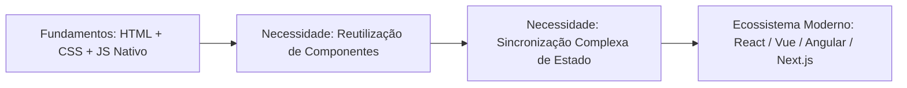

# Aula 08: Depuração com DevTools, Panorama de Frameworks e Avaliação A3

## 🎯 Objetivos da Aula
- Dominar o uso avançado do **Chrome DevTools**: inspeção de rede (Aba Network), depuração com pontos de interrupção (**Breakpoints**) no painel Sources e medição de desempenho.
- Compreender o panorama geral da web moderna: por que existem bibliotecas e frameworks como **React**, **Vue.js** e **Angular**, e onde o JavaScript Vanilla se encaixa.
- Integrar com harmonia os três pilares da disciplina: HTML5 Semântico, CSS3 Responsivo e JavaScript Dinâmico.
- Apresentar, avaliar e entregar o **Projeto Integrador Final (Avaliação A3)**.

---

## 🧭 Roteiro da Aula
1. **Depuração Profissional:** Pare de usar apenas `console.log()` e aprenda a congelar o código no DevTools com Breakpoints.
2. **Aba Network:** Inspecionando o tempo de carregamento de imagens, scripts e códigos de status HTTP (200, 404, 500).
3. **O Futuro do Front-end:** Como a base sólida que você adquiriu agora te prepara para aprender React ou Node.js.
4. **Laboratório e Entrega A3:** Siga as orientações finais em [laboratorio.md](laboratorio.md) e o regulamento em [Avaliações A3](../Avaliacoes/A3/README.md).

---

## 📖 1. Depuração Profissional com o Painel Sources

O `console.log()` é útil, mas em projetos reais você precisa de ferramentas de diagnóstico profissionais:

### Como usar Breakpoints no Chrome DevTools:
1. Abra o DevTools com `F12`.
2. Vá para a aba **Sources** (Fontes).
3. Na árvore de arquivos à esquerda, abra o seu arquivo `.js`.
4. Clique no **número da linha** onde você deseja congelar a execução: um marcador azul aparecerá (Breakpoint).
5. Dispare a ação na página (ex: clique no botão).
6. **A mágica acontece:** O navegador pausa a execução exatamente naquela linha antes dela rodar!
7. Você pode passar o mouse sobre as variáveis para ver seus valores atuais em tempo real, testar expressões no console e avançar linha a linha usando as teclas `F10` (Step over) e `F11` (Step into).

---

## 📖 2. A Aba Network (Rede)

A aba **Network** registra cada requisição feita pelo navegador para montar a página:
* **Waterfall (Cascata):** Mostra quanto tempo cada arquivo demorou para baixar (DNS, conexão, download de bytes).
* **Status HTTP:** Verifica se alguma imagem deu `404 Not Found` ou se um script falhou.
* **Filtros:** Permite filtrar apenas arquivos `Doc` (HTML), `CSS`, `JS` ou `Img`.
* **Throttling (Simulação de Rede Lenta):** Permite simular como seu site carrega em um celular com 3G Lento (*Slow 3G*).

---

## 📖 3. Panorama do Ecossistema: Por que Existem React e Vue?

Ao final deste curso de Fundamentos, muitos alunos se perguntam: *"Se já conseguimos fazer tudo com HTML, CSS e JavaScript puro, por que as empresas usam React, Vue ou Angular?"*

### O que os Frameworks Resolvem em Grandes Aplicações:
1. **Componentização Extrema:** Em vez de repetir código de card de produto 50 vezes, você cria um componente `<CardProduto />` e reutiliza.
2. **Gerenciamento de Estado Reativo:** Em sites gigantes como Facebook ou Netflix, quando você clica em "curtir", 10 lugares diferentes da tela precisam atualizar simultaneamente. Frameworks atualizam a interface automaticamente sem você precisar fazer dezenas de `querySelector` manuais.
3. **Single Page Applications (SPA):** Navegação instantânea de páginas sem recarregar o navegador.

> **Mensagem do Professor:** Nenhum desenvolvedor domina React ou Vue sem antes ser impecável em HTML5 semântico, Flexbox/Grid e manipulação de arrays e objetos no JavaScript puro. Vocês construíram a base mais sólida possível!

---

## 🏆 4. A Avaliação Final A3 (Projeto Integrador)

Chegou a hora de reunir todo o conhecimento das 8 aulas em um projeto front-end autoral e completo. Consulte os requisitos detalhados em [Avaliações A3](../Avaliacoes/A3/README.md)!
