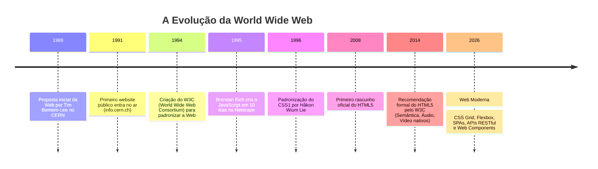
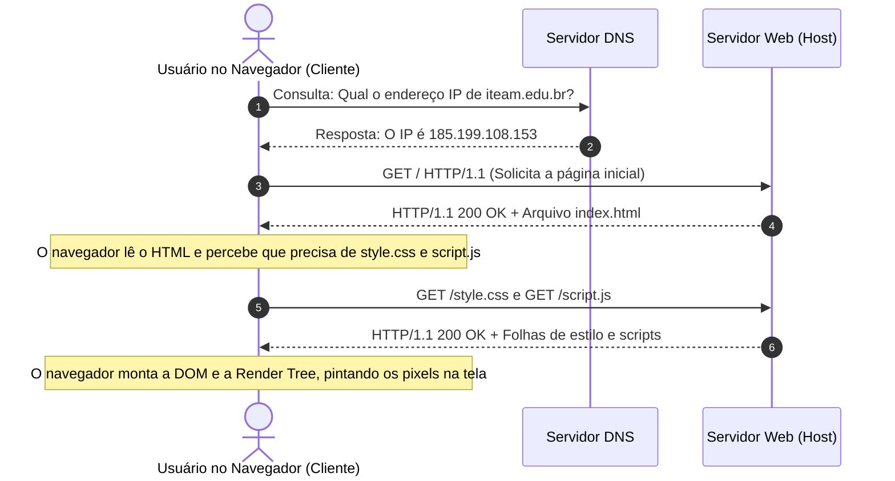
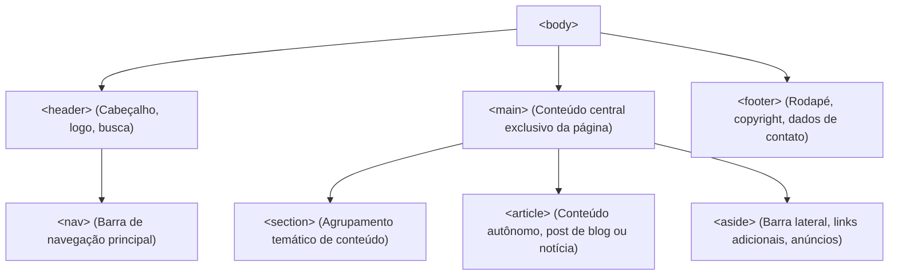
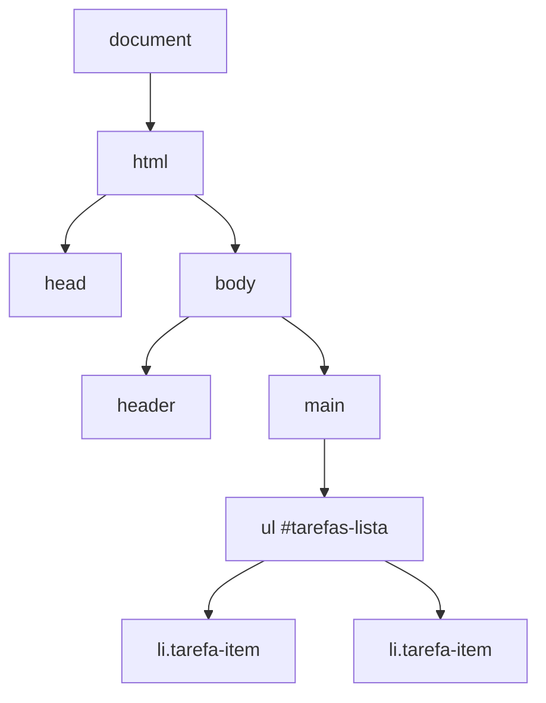

# 📘 Apostila Completa de Fundamentos de Desenvolvimento Web
> **Curso:** Capacitação em Desenvolvimento Full Stack  
> **Disciplina:** Fundamentos de Desenvolvimento Web (HTML5, CSS3 & JavaScript)  
> **Instituição:** Instituto de Tecnologia e Aprendizado Moderno (ITEAM) — Boa Vista / RR  
> **Carga Horária:** 32 Horas de Imersão Prática e Conceitual  
> **Autores & Equipe Pedagógica:** Coordenação de Tecnologia ITEAM

---

## 📑 Sumário Geral

1. [Capítulo 0 — A História, a Arquitetura e a Revolução da Web](#capítulo-0--a-história-a-arquitetura-e-a-revolução-da-web)
2. [Capítulo 1 — Arquitetura de Redes e Ambiente de Desenvolvimento](#capítulo-1--arquitetura-de-redes-e-ambiente-de-desenvolvimento)
3. [Capítulo 2 — Estruturação Semântica Moderna com HTML5](#capítulo-2--estruturação-semântica-moderna-com-html5)
4. [Capítulo 3 — Formulários Web Avançados, Acessibilidade e Validações Nativas](#capítulo-3--formulários-web-avançados-acessibilidade-e-validações-nativas)
5. [Capítulo 4 — Estilização Profissional com CSS3 e o Modelo de Caixa (Box Model)](#capítulo-4--estilização-profissional-com-css3-e-o-modelo-de-caixa-box-model)
6. [Capítulo 5 — Layouts Modernos: Flexbox, CSS Grid e Design Responsivo Mobile-First](#capítulo-5--layouts-modernos-flexbox-css-grid-e-design-responsivo-mobile-first)
7. [Capítulo 6 — Lógica de Programação e JavaScript Essencial](#capítulo-6--lógica-de-programação-e-javascript-essencial)
8. [Capítulo 7 — Interatividade Dinâmica: Manipulação da DOM e Eventos](#capítulo-7--interatividade-dinâmica-manipulação-da-dom-e-eventos)
9. [Capítulo 8 — Depuração com DevTools, Persistência Local e o Ecossistema Moderno](#capítulo-8--depuração-com-devtools-persistência-local-e-o-ecossistema-moderno)
10. [Capítulo 9 — Matriz das Avaliações Práticas Oficiais (A1, A2 e A3)](#capítulo-9--matriz-das-avaliações-práticas-oficiais-a1-a2-e-a3)

---

## Capítulo 0 — A História, a Arquitetura e a Revolução da Web

### 0.1 O Nascimento da Web no CERN (1989)
Em 1989, no renomado laboratório de física de partículas **CERN** (Organização Europeia para a Pesquisa Nuclear), localizado na fronteira entre a Suíça e a França, cientistas do mundo inteiro enfrentavam uma barreira colossal: computadores rodavam sistemas operacionais diferentes, com formatos de arquivos incompatíveis. Trocar dados sobre experimentos exigia configurações manuais exaustivas.

Um cientista da computação britânico chamado **Tim Berners-Lee** enxergou a solução: combinar a infraestrutura de redes existente (a Internet) com o conceito de **hipertexto** (textos com links que apontam para outros textos).

Para tornar essa visão realidade, Berners-Lee inventou três tecnologias que formam a espinha dorsal de tudo o que consumimos na Internet até hoje:
1. **HTML (HyperText Markup Language):** A linguagem padrão para formatar e conectar documentos na rede.
2. **HTTP (HyperText Transfer Protocol):** O protocolo de comunicação para transferir hipertextos entre cliente e servidor.
3. **URI/URL (Uniform Resource Identifier / Locator):** O sistema global de endereçamento unificado para localizar qualquer recurso em qualquer máquina do mundo.



### 0.2 Internet vs. World Wide Web: Não Confunda!
Muitas pessoas utilizam "Internet" e "Web" como sinônimos, mas tecnicamente são coisas muito distintas:
- **A Internet é a Rodovia:** É a infraestrutura física global composta por cabos submarinos de fibra óptica, satélites, roteadores e servidores que conectam bilhões de dispositivos.
- **A Web é o Caminhão:** É uma das muitas aplicações que trafegam sobre a rodovia da Internet. Outros serviços que também usam a Internet (sem necessariamente usar a Web) incluem e-mail (protocolos SMTP/IMAP), transferência de arquivos (FTP), chamadas de voz sobre IP (VoIP) e jogos multiplayer.

### 0.3 A Tríade Essencial do Frontend
Qualquer página ou aplicativo na Web é construído sobre a interação harmoniosa de três pilares:

```
+-----------------------------------------------------------------------+
|                            PÁGINA WEB                                 |
+-----------------------------------------------------------------------+
|  1. HTML (Esqueleto / Estrutura)                                      |
|     - Define o conteúdo, a semântica e a hierarquia dos elementos.    |
|                                                                       |
|  2. CSS (Pele / Apresentação)                                         |
|     - Define a estética, cores, tipografia, espaçamentos e layouts.   |
|                                                                       |
|  3. JavaScript (Músculos / Cérebro / Comportamento)                   |
|     - Controla a interatividade, eventos, cálculos e validações.      |
+-----------------------------------------------------------------------+
```

---

## Capítulo 1 — Arquitetura de Redes e Ambiente de Desenvolvimento

### 1.1 O Modelo Cliente-Servidor e o Ciclo HTTP
A comunicação na Web opera estritamente no modelo **Requisição e Resposta (Request-Response)**:
1. **O Cliente (Navegador):** Envia uma requisição solicitando um recurso específico.
2. **O Servidor:** Recebe a solicitação, processa a regra de negócio e devolve uma resposta com o código de status e o conteúdo correspondente.



### 1.2 Anatomia dos Códigos de Status HTTP
Quando o servidor responde, ele envia um código numérico de 3 dígitos agrupado por famílias:
- **1xx (Informativo):** A requisição foi recebida e o processo continua.
- **2xx (Sucesso):** A requisição foi processada com êxito (`200 OK`, `201 Created`, `204 No Content`).
- **3xx (Redirecionamento):** O recurso mudou de lugar (`301 Moved Permanently`, `302 Found`).
- **4xx (Erro do Cliente):** A requisição continha dados inválidos ou o recurso não existe (`400 Bad Request`, `401 Unauthorized`, `403 Forbidden`, `404 Not Found`).
- **5xx (Erro do Servidor):** Falha interna no processamento no servidor (`500 Internal Server Error`, `502 Bad Gateway`, `503 Service Unavailable`).

### 1.3 Configuração do Ambiente Profissional
Para construir sites profissionais, utilizamos a tríade de ferramentas padrão de mercado:
1. **Visual Studio Code (VS Code):** O editor de código open-source mais utilizado no planeta.
2. **Extensão Live Server:** Cria um servidor de desenvolvimento local que escuta alterações nos arquivos HTML, CSS e JS e atualiza a aba do navegador instantaneamente (Hot Reload) sem necessidade de `F5`.
3. **Atalhos Emmet:** O VS Code inclui nativamente o motor Emmet, que expande abreviações em código HTML completo:
   - Digitar `!` e apertar `Tab` gera o esqueleto HTML5 completo.
   - Digitar `nav>ul>li*3>a` gera um menu de navegação completo com 3 links.
   - Digitar `article.card>h2+p+button.btn` gera um card estruturado com título, parágrafo e botão com classe.

### 1.4 O Esqueleto Fundamental do HTML5
```html
<!DOCTYPE html>
<html lang="pt-BR">
<head>
  <!-- Metadados de codificação e responsividade -->
  <meta charset="UTF-8">
  <meta name="viewport" content="width=device-width, initial-scale=1.0">
  <title>Portal Web Profissional | ITEAM</title>

  <!-- Ligação com a folha de estilos externa -->
  <link rel="stylesheet" href="style.css">
</head>
<body>
  <!-- Todo o conteúdo visível ao usuário fica aqui -->
  <header>
    <h1>Desenvolvimento Web Moderno</h1>
  </header>

  <!-- Scripts carregados preferencialmente ao final do body -->
  <script src="app.js"></script>
</body>
</html>
```

---

## Capítulo 2 — Estruturação Semântica Moderna com HTML5

### 2.1 O que é Semântica e por que ela é Vital?
Escrever HTML semântico significa utilizar tags que informam **o significado e a finalidade do conteúdo**, e não simplesmente como ele deve parecer visualmente na tela.

Antes do HTML5, páginas utilizavam uma proliferação infinita de tags `<div>` genéricas (`<div id="topo">`, `<div class="noticia">`, `<div id="rodape">`), um antipadrão conhecido como **Div Soup (Sopa de Divs)**.

**Os 3 Grandes Benefícios da Semântica:**
1. **Acessibilidade Universal (a11y & WCAG):** Pessoas com deficiência visual utilizam softwares leitores de tela (como NVDA ou VoiceOver). O leitor anuncia seções com clareza: *"Entrando na navegação principal"*, *"Artigo: Lançamento de IA"*, permitindo saltar diretamente para o conteúdo desejado.
2. **Otimização para Mecanismos de Busca (SEO):** Algoritmos do Google e do Bing utilizam tags semânticas para indexar e entender quais partes do seu site são artigos, quais são menus e quem é o autor, elevando sua posição no ranking.
3. **Manutenibilidade de Código:** Qualquer desenvolvedor que abrir o projeto compreenderá a arquitetura imediatamente.



### 2.2 Diferença Prática: `<article>` vs. `<section>`
- **`<article>`:** Representa um conteúdo autônomo e independente. Se você recortar o elemento e colá-lo em uma newsletter ou agregador RSS, ele fará sentido completo por si só (ex: um post de blog, um comentário, um card de produto).
- **`<section>`:** Representa uma divisão temática ou um capítulo dentro de um documento maior (ex: "Sobre a Empresa", "Serviços", "Perguntas Frequentes"). Não deve ser usado apenas para aplicar estilização visual (para isso, use `<div>`).

### 2.3 Tabelas Semânticas Acessíveis
Tabelas devem ser usadas unicamente para **dados tabulares**, e nunca para criar layouts visuais:

```html
<table border="1">
  <caption>Tabela de Alunos e Médias Bimestrais</caption>
  <thead>
    <tr>
      <th scope="col">Matrícula</th>
      <th scope="col">Nome do Aluno</th>
      <th scope="col">Avaliação A1</th>
      <th scope="col">Situação</th>
    </tr>
  </thead>
  <tbody>
    <tr>
      <td>202601</td>
      <td>Lucas Silva</td>
      <td>9.5</td>
      <td>Aprovado</td>
    </tr>
    <tr>
      <td>202602</td>
      <td>Beatriz Souza</td>
      <td>8.0</td>
      <td>Aprovado</td>
    </tr>
  </tbody>
  <tfoot>
    <tr>
      <th scope="row" colspan="2">Média da Turma</th>
      <td colspan="2">8.75</td>
    </tr>
  </tfoot>
</table>
```

### 2.4 Multimídia Moderna: Imagens, Áudio e Vídeo
- **Imagens Acessíveis:** O atributo `alt` é obrigatório. Se a imagem carregar com erro ou for lida por um leitor de tela, a descrição garante o entendimento:
  ```html
  <figure>
    
    <figcaption>Figura 1: Desempenho trimestral consolidado.</figcaption>
  </figure>
  ```
- **Áudio e Vídeo Nativos:** Não exigem plugins externos:
  ```html
  <video controls width="640" poster="img/thumb-video.jpg">
    <source src="midia/aula01.mp4" type="video/mp4">
    <source src="midia/aula01.webm" type="video/webm">
    Seu navegador não suporta a tag de vídeo nativa.
  </video>
  ```

---

## Capítulo 3 — Formulários Web Avançados, Acessibilidade e Validações Nativas

### 3.1 Anatomia e Comunicação com o Backend
O formulário HTML é a principal ponte de entrada de dados entre o usuário e o servidor web.
- `action`: Endpoint ou URL para onde os dados serão despachados.
- `method`: O método HTTP de transmissão:
  - `GET`: Os dados são anexados na URL como parâmetros de consulta (query string). Usado para pesquisas e filtros.
  - `POST`: Os dados viajam no corpo (body) da mensagem HTTP, de forma segura e sem poluir a URL. Obrigatório para criação de contas, senhas e pagamentos.

### 3.2 Acessibilidade Obrigatória: `<label for>`
Nunca crie um `<input>` isolado sem um `<label>`. Vincule o atributo `for` da label ao `id` do input. Isso amplia a área de clique (clicar no texto foca no campo) e permite aos softwares de voz ler o nome do campo:

```html
<!-- Associação perfeita e obrigatória -->
<label for="campo-email">E-mail Institucional: *</label>
<input type="email" id="campo-email" name="email" required placeholder="aluno@iteam.edu.br">
```

### 3.3 Tipos Modernos de Entrada e Validação Nativa
O HTML5 possui um mecanismo interno poderoso de validação que impede o envio de dados corrompidos antes mesmo de chamar qualquer JavaScript:

| Atributo | Finalidade | Exemplo Prático |
| :--- | :--- | :--- |
| `required` | Bloqueia envio se o campo estiver vazio | `<input required>` |
| `minlength` / `maxlength` | Controla tamanho mínimo e máximo de caracteres | `<input minlength="8" maxlength="20">` |
| `min` / `max` | Limita intervalos numéricos ou datas permitidas | `<input type="number" min="18" max="99">` |
| `pattern` | Validação estrita por Expressão Regular (Regex) | `pattern="\([0-9]{2}\)\s?[0-9]{5}-[0-9]{4}"` |
| `title` | Mensagem de instrução que o navegador exibe quando o padrão falha | `title="Formato: (95) 99999-9999"` |

### 3.4 Exemplo de Formulário Completo e Padronizado
```html
<form action="/api/inscricao" method="POST">
  <fieldset>
    <legend>Dados de Inscrição no ITEAM</legend>

    <p>
      <label for="nome">Nome Completo: *</label><br>
      <input type="text" id="nome" name="nome" required minlength="4">
    </p>

    <p>
      <label for="telefone">WhatsApp: *</label><br>
      <input type="tel" id="telefone" name="telefone" required pattern="\([0-9]{2}\)\s?[0-9]{4,5}-[0-9]{4}" placeholder="(95) 99999-9999" title="Informe no padrão (95) 99999-9999">
    </p>

    <p>
      <label for="curso">Selecione seu Módulo: *</label><br>
      <select id="curso" name="curso" required>
        <option value="">-- Escolha um Módulo --</option>
        <option value="web">Fundamentos Web (HTML, CSS e JS)</option>
        <option value="node">Backend com Node.js e Express</option>
      </select>
    </p>

    <p>
      <label>
        <input type="checkbox" name="termos" required> Concordo com os termos do curso.
      </label>
    </p>
  </fieldset>

  <button type="submit">Confirmar Inscrição</button>
</form>
```

---

## Capítulo 4 — Estilização Profissional com CSS3 e o Modelo de Caixa (Box Model)

### 4.1 A Anatomia do CSS
O CSS (Cascading Style Sheets) transforma a estrutura crua do HTML em uma experiência visual polida e agradável:

```css
/* Seletor */
.botao-destaque {
  /* Propriedade : Valor; */
  background-color: #2563eb;
  color: #ffffff;
  padding: 12px 24px;
  border-radius: 8px;
}
```

### 4.2 O Modelo de Caixa (Box Model) Explicado
Cada elemento na tela é interpretado pelo navegador como uma caixa retangular composta por quatro camadas concêntricas:

```
+-------------------------------------------------------------------+
| MARGIN (Margem externa invisível que separa elementos vizinhos)   |
|  +-------------------------------------------------------------+  |
|  | BORDER (Borda física desenhada ao redor da caixa)           |  |
|  |  +-------------------------------------------------------+  |  |
|  |  | PADDING (Espaçamento interno entre a borda e o texto) |  |  |
|  |  |  +-------------------------------------------------+  |  |  |
|  |  |  | CONTENT (Conteúdo real: texto, imagem, ícone)   |  |  |  |
|  |  |  +-------------------------------------------------+  |  |  |
|  |  +-------------------------------------------------------+  |  |
|  +-------------------------------------------------------------+  |
+-------------------------------------------------------------------+
```

### 4.3 A Revolução do `box-sizing: border-box`
No modelo clássico (`box-sizing: content-box`), se você criava um card com `width: 300px` e adicionava `padding: 20px` e `border: 2px`, o navegador somava tudo:
$$	ext{Largura Total} = 300 + 20 + 20 + 2 + 2 = 344	ext{px}$$
Isso quebrava layouts frequentemente!

Com `box-sizing: border-box`, a largura informada é a largura total real. O padding e a borda são comprimidos **para dentro** da caixa:

```css
/* Reset Padrão Ouro — Coloque no topo de todo projeto CSS */
*, *::before, *::after {
  margin: 0;
  padding: 0;
  box-sizing: border-box;
}
```

### 4.4 Custom Properties (Variáveis CSS `:root`)
Centralize design tokens (cores, fontes, bordas) no seletor `:root` para consistência e facilidade em criar Dark Mode:

```css
:root {
  --primary: #4f46e5;
  --primary-hover: #4338ca;
  --bg-page: #f8fafc;
  --text-dark: #0f172a;
  --radius-card: 12px;
}

body {
  background-color: var(--bg-page);
  color: var(--text-dark);
  font-family: 'Inter', sans-serif;
}
```

---

## Capítulo 5 — Layouts Modernos: Flexbox, CSS Grid e Design Responsivo Mobile-First

### 5.1 Flexbox (Unidimensional) vs. CSS Grid (Bidimensional)
- **Flexbox:** Excelente para organizar itens ao longo de uma **única direção** (linha OU coluna). Perfeito para barras de navegação, cards centralizados, botões de ação e componentes modulares.
- **CSS Grid:** Excelente para organizar itens em **duas direções simultâneas** (linhas E colunas). Perfeito para estruturar páginas completas, dashboards e galerias complexas de conteúdo.

### 5.2 O Poder do Flexbox
Principais propriedades do Container Flex:
- `display: flex;`: Ativa o contexto flexível.
- `flex-direction: row | column;`: Define a direção do eixo principal.
- `justify-content: flex-start | center | space-between | space-around;`: Alinha itens no eixo principal.
- `align-items: stretch | center | flex-start | flex-end;`: Alinha itens no eixo transversal.
- `gap: 1rem;`: Define o espaçamento limpo entre os filhos sem precisar de margens manuais.

```css
/* Barra de Navegação com Flexbox */
.navbar {
  display: flex;
  justify-content: space-between;
  align-items: center;
  padding: 1rem 2rem;
  background-color: #ffffff;
  border-bottom: 1px solid #e2e8f0;
}
```

### 5.3 O Grid Perfeito e Responsivo com `auto-fit`
Com uma única linha mágica de CSS Grid, criamos uma galeria de produtos que se adapta automaticamente a qualquer tamanho de tela sem necessidade de dezenas de media queries manuais:

```css
.produtos-grid {
  display: grid;
  /* Cria tantas colunas de no mínimo 280px quantas couberem na tela */
  grid-template-columns: repeat(auto-fit, minmax(280px, 1fr));
  gap: 1.5rem;
  padding: 2rem;
}
```

### 5.4 Design Responsivo Mobile-First
Desenvolver **Mobile-First** significa construir a folha de estilos começando pela menor tela (smartphones) e adicionando regras para telas maiores via `@media (min-width: ...)`:

```css
/* 1. Base Mobile (Smartphone: 1 coluna padrão) */
.layout-container {
  display: flex;
  flex-direction: column;
  padding: 1rem;
}

/* 2. Tablets (a partir de 640px) */
@media (min-width: 640px) {
  .layout-container {
    padding: 2rem;
  }
}

/* 3. Desktops (a partir de 1024px) */
@media (min-width: 1024px) {
  .layout-container {
    flex-direction: row;
    max-width: 1200px;
    margin: 0 auto;
  }
}
```

---

## Capítulo 6 — Lógica de Programação e JavaScript Essencial

### 6.1 Por que abandonar o `var` e dominar `const` e `let`?
- `const`: Bloqueia reatribuição de valor. Deve ser sua escolha padrão em 90% do código moderno.
- `let`: Permite reatribuição de valor, com escopo restrito ao bloco `{ }` onde foi declarado. Ideal para contadores de loops.
- `var`: **Obsoleto no padrão ES6+**. Vaza escopos de blocos e sofre problemas de "hoisting" imprevisíveis.

### 6.2 Tipos de Dados Primitivos
O JavaScript possui tipagem dinâmica. Os tipos primitivos fundamentais são:
```javascript
const curso = "Fundamentos Web";   // String (texto)
const aulas = 8;                   // Number (inteiro)
const mediaMinima = 7.0;           // Number (ponto flutuante)
const matriculasAbertas = true;    // Boolean (verdadeiro ou falso)
let proximaData;                   // Undefined (variável declarada sem atribuição)
const professorSubstituto = null;  // Null (ausência intencional de valor)
```

### 6.3 A Regra da Igualdade Estrita (`===`)
Nunca utilize a igualdade fraca `==`, pois ela tenta forçar a conversão de tipo automaticamente:
```javascript
console.log(5 == "5");   // true  (Perigoso! Number comparado com String)
console.log(5 === "5");  // false (Correto! Tipos diferentes nunca são iguais)
console.log(5 !== "5");  // true  (Estritamente diferente)
```

### 6.4 Métodos Funcionais Modernos de Array
Esqueça loops manuais com `for` tradicional quando estiver trabalhando com listas de dados:
```javascript
const alunos = [
  { id: 1, nome: "Alice", nota: 9.0, ativo: true },
  { id: 2, nome: "Carlos", nota: 6.5, ativo: true },
  { id: 3, nome: "Débora", nota: 4.0, ativo: false }
];

// 1. .filter(): Retorna um NOVO array com os elementos aprovados
const aprovados = alunos.filter(a => a.nota >= 7.0);

// 2. .map(): Transforma cada item gerando uma nova lista
const nomes = alunos.map(a => a.nome.toUpperCase());

// 3. .find(): Encontra o PRIMEIRO item que atende ao critério
const alunoPorId = alunos.find(a => a.id === 2);

// 4. .reduce(): Acumula valores para obter totais ou médias
const somaNotas = alunos.reduce((acumulado, a) => acumulado + a.nota, 0);
const mediaGeral = somaNotas / alunos.length;
```

---

## Capítulo 7 — Interatividade Dinâmica: Manipulação da DOM e Eventos

### 7.1 O que é a DOM (Document Object Model)?
Quando o navegador baixa o HTML, ele cria na memória uma árvore viva de objetos chamada **DOM**. O JavaScript não lê arquivos de texto diretamente; ele conversa com os nós dessa árvore.



### 7.2 Seleção e Manipulação de Elementos
Utilizamos os seletores modernos equivalentes aos do CSS:
```javascript
// Seleciona um único elemento pelo ID ou classe
const form = document.querySelector("#novo-item-form");
const input = document.querySelector("#item-nome");
const lista = document.querySelector("#lista");

// Modifica propriedades
input.placeholder = "Digite uma tarefa...";
lista.classList.add("ativo");
lista.classList.toggle("destaque");
```

### 7.3 Escuta de Eventos e Prevenção do Comportamento Padrão
O método `addEventListener` conecta ações do usuário a funções do JavaScript:
```javascript
form.addEventListener("submit", (event) => {
  // CRUCIAL: Impede que o formulário recarregue a página inteira
  event.preventDefault();

  const texto = input.value.trim();
  if (texto === "") return;

  // 1. Cria o elemento li na memória
  const novoLi = document.createElement("li");
  novoLi.textContent = texto;

  // 2. Cria botão de excluir
  const btnExcluir = document.createElement("button");
  btnExcluir.textContent = "Remover";
  btnExcluir.addEventListener("click", () => {
    novoLi.remove(); // Remove o elemento da tela
  });

  // 3. Injeta os elementos na DOM
  novoLi.appendChild(btnExcluir);
  lista.appendChild(novoLi);

  // 4. Limpa e foca no campo
  input.value = "";
  input.focus();
});
```

---

## Capítulo 8 — Depuração com DevTools, Persistência Local e o Ecossistema Moderno

### 8.1 As Quatro Abas Vitais do Chrome DevTools (Tecla F12)
1. **Elements:** Inspecione e edite em tempo real qualquer elemento HTML ou regra CSS. Permite visualizar os anéis coloridos do Box Model.
2. **Console:** Mostra erros de JavaScript, avisos de segurança e permite testar comandos interativamente (`console.log()`, `console.table()`).
3. **Sources:** Permite depurar linha a linha inserindo **Breakpoints**. O navegador pausa a execução e permite inspecionar o valor de cada variável naquele instante.
4. **Network:** Registra cada arquivo ou chamada HTTP feita pela página, informando status (`200`, `404`), tempo de resposta e peso em kilobytes.

### 8.2 Persistência de Dados no Navegador com `localStorage`
O `localStorage` permite guardar até 5MB de dados no computador do usuário que sobrevivem mesmo se ele fechar a aba ou reiniciar a máquina:
- Ele aceita exclusivamente **Strings**. Por isso, usamos `JSON.stringify()` para gravar objetos e `JSON.parse()` para ler.

```javascript
const CHAVE_STORAGE = "@iteam:configuracoes";

// Salvando dados
function salvarPreferencias(usuario, temaEscuro) {
  const dados = {
    usuario: usuario,
    darkTheme: temaEscuro,
    dataLogin: new Date().toISOString()
  };
  localStorage.setItem(CHAVE_STORAGE, JSON.stringify(dados));
}

// Recuperando dados
function carregarPreferencias() {
  const salvo = localStorage.getItem(CHAVE_STORAGE);
  if (!salvo) return null;

  try {
    return JSON.parse(salvo);
  } catch (erro) {
    console.error("Falha ao desserializar JSON:", erro);
    return null;
  }
}
```

### 8.3 O Ecossistema Web Completo e o Próximo Passo
Ao dominar os fundamentos abordados nesta apostila, você está plenamente apto a dar o salto para o ecossistema avançado:
- **Node.js & Express:** Utilize o mesmo JavaScript que aprendeu no navegador para construir APIs de alta performance no servidor, manipular bancos de dados relacionais (PostgreSQL/SQLite) e emitir tokens JWT de segurança.
- **Frameworks Reativos (React / Next.js / Vue):** Construa interfaces de usuário com componentes reutilizáveis, gerenciamento de estado e renderização no servidor.
- **Git & GitHub:** Pratique versionamento profissional, pull requests e trabalho em equipe ágil.

---

## Capítulo 9 — Matriz das Avaliações Práticas Oficiais (A1, A2 e A3)

| Avaliação | Momento de Entrega | Peso na Média | Escopo & Descrição do Projeto |
| :---: | :---: | :---: | :--- |
| **Avaliação A1** | Final da Aula 03 | 30% | **Portal Semântico com Formulário Acessível:** Construção de uma página completa em HTML5 semântico com validação nativa de formulários, tabela de dados e mídia com acessibilidade. |
| **Avaliação A2** | Final da Aula 05 | 35% | **Interface Web Moderna e Responsiva:** Estilização profissional com CSS3, arquitetura de design tokens (`:root`), Flexbox, CSS Grid com `auto-fit` e abordagem Mobile-First. |
| **Avaliação A3** | Final da Aula 08 | 35% | **Projeto Integrador Interativo Completo:** Aplicação Web interativa integrando a tríade completa (HTML5 + CSS3 + JS DOM) com escuta de eventos e persistência via `localStorage`. |

---
**Instituto de Tecnologia e Aprendizado Moderno — ITEAM**  
*Formando profissionais e líderes para o futuro da tecnologia.*
